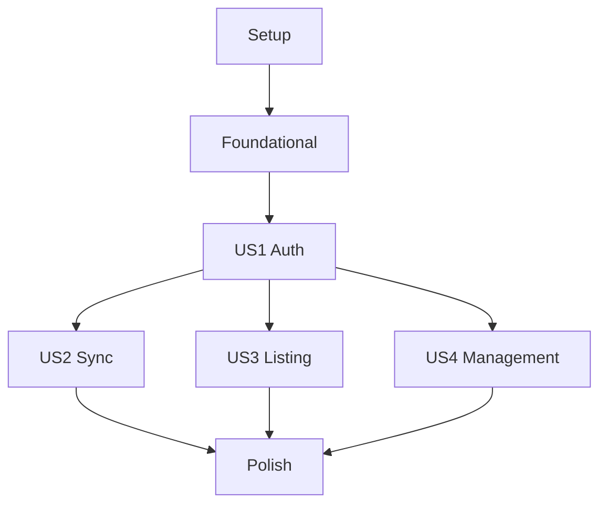

# Task Breakdown: Gestión de Base de Conocimiento RAG (Knowledge Stores)

**Feature**: 002-rag-knowledge-base
**Status**: Draft
**Total Tasks**: 24

## Phase 1: Setup (Project Initialization)
Goal: Initialize the microservice structure and configuration.

- [x] T001 Create project directory structure in `apis/knowledge_stores/`
- [x] T002 Initialize `pyproject.toml` with `fastapi`, `google-cloud-storage`, `google-cloud-bigquery`, `google-generativeai` in `apis/knowledge_stores/`
- [x] T003 [P] Create local configuration handler for env vars in `apis/knowledge_stores/config.py`
- [x] T004 [P] Create initial FastAPI entry point in `apis/knowledge_stores/main.py`

## Phase 2: Foundational (Blocking Prerequisites)
Goal: Establish core utilities for and database schemas.

- [x] T005 [P] Define BigQuery table schemas for `users`, `authentication_log`, `knowledge_store_api_log`, and `knowledge_document_sync_log` in `apis/knowledge_stores/schemas/bq_schemas.py`
- [x] T006 Implement BigQuery base repository with partition-aware inserts in `apis/knowledge_stores/core/db.py`
- [x] T007 [P] Initialize Gemini GenAI client wrapper for `file_search_stores` in `apis/knowledge_stores/core/gemini_client.py`

## Phase 3: [US1] Autenticación y Sincronización de Usuarios
Goal: Secure the API and track user identity via Firebase.
**Test Criteria**: Requests without valid JWT return 401; Valid JWT upserts user in BQ.

- [x] T008 [US1] Implement `AuthMiddleware` to validate Firebase JWT tokens in `apis/knowledge_stores/core/auth_middleware.py`
- [x] T009 [US1] Implement `upsert_user` logic in `apis/knowledge_stores/core/db.py`
- [x] T010 [US1] Implement async `log_authentication` task in `apis/knowledge_stores/core/db.py`
- [x] T011 [US1] Integrate `AuthMiddleware` in the main FastAPI application in `apis/knowledge_stores/main.py`

## Phase 4: [US2] Ingesta y Sincronización Incremental (Mirroring)
Goal: Logic to mirror GCS buckets to Gemini Stores based on file size.
**Test Criteria**: Syncing an empty store uploads all files; Consecutive syncs skip all files.

- [x] T012 [US2] Implement GCS client to list blobs and metadata in `apis/knowledge_stores/core/gcs_client.py`
- [x] T013 [US2] Implement incremental sync logic (Delta: Upload/Skip/Replace/Delete) in `apis/knowledge_stores/services/sync_service.py`
- [x] T014 [US2] Implement POST `/knowledge-stores/sync` endpoint in `apis/knowledge_stores/main.py`
- [x] T015 [US2] Add `log_document_sync` as a background task in `apis/knowledge_stores/core/db.py`

## Phase 5: [US3] Listado Total de Repositorios y Archivos
Goal: Provide comprehensive visibility of the knowledge base.
**Test Criteria**: GET endpoints return flat JSON list without visible server-side pagination.

- [x] T016 [US3] [P] Implement GET `/knowledge-stores` to list all stores from Gemini in `apis/knowledge_stores/main.py`
- [x] T017 [US3] Implement GET `/knowledge-stores/{store_id}/files` with iterator-to-list conversion in `apis/knowledge_stores/main.py`
- [x] T018 [US3] [P] Implement async `log_api_transaction` for GET requests in `apis/knowledge_stores/core/db.py`

## Phase 6: [US4] Depuración de Conocimiento (Borrado Manual)
Goal: Manual management of stores and individual documents.
**Test Criteria**: DELETE endpoints return 204 and remove records from Gemini only.

- [x] T019 [US4] [P] Implement DELETE `/knowledge-stores/{store_id}` in `apis/knowledge_stores/main.py`
- [x] T020 [US4] Implement DELETE `/knowledge-stores/{store_id}/files/{file_id}` in `apis/knowledge_stores/main.py`

## Phase 7: Polish & Deployment
Goal: Error handling, documentation, and production readiness.

- [x] T021 Implement global exception handler for HTTP 403, 429, and 500 in `apis/knowledge_stores/main.py`
- [x] T022 [P] Create `Dockerfile` and `cloudbuild.yaml` in `apis/knowledge_stores/deploy/`
- [x] T023 Update `OPENCLAW_TOOLS.md` with the new Knowledge Store capabilities at the root
- [x] T024 Perform final end-to-end dry run and verify BQ logs consistency

## Dependency Graph

## Implementation Strategy
1. **MVP Scope**: Complete Phase 1 to Phase 3. This establishes the secure foundation.
2. **Incremental Delivery**: Phase 4 is the core value (syncing). Phase 5 & 6 provide management capabilities.
3. **Parallel Execution**: 
   - T003, T004, and T005 can be started simultaneously.
   - T016, T018, and T019 can be implemented in parallel after Phase 3.
